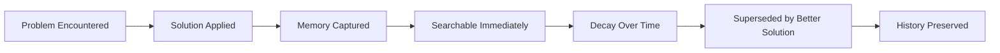

# Tutorial: Capture Your First Memory

Learn how memories are captured, stored, and retrieved by working through a real example.

**Time required:** 20 minutes
**Prerequisites:** Completed [installation tutorial](01-installation.md)

## What You'll Learn

- How memories are automatically captured
- The lifecycle of a memory from creation to retrieval
- How temporal decay affects memory scores
- The connection between Claude Code and GTD Coach

## Step 1: Create a Problem to Solve

Let's create a simple Python file with an intentional bug:

```bash
# Create a test file
cat > test_memory.py << 'EOF'
def calculate_average(numbers):
    # Bug: Doesn't handle empty list
    return sum(numbers) / len(numbers)

# This will crash
result = calculate_average([])
print(f"Average: {result}")
EOF
```

Run it to see the error:
```bash
python test_memory.py
```

You'll see:
```
ZeroDivisionError: division by zero
```

## Step 2: Fix the Problem with Claude Code

Ask Claude Code to fix this:

```
"Fix the ZeroDivisionError in test_memory.py when the list is empty"
```

Claude Code will:
1. Identify the issue
2. Apply a fix
3. **Automatically capture this solution in memory**

The fixed code:
```python
def calculate_average(numbers):
    if not numbers:
        return 0
    return sum(numbers) / len(numbers)
```

## Step 3: Observe Memory Capture

Behind the scenes, the memory system captured:

```python
{
    "type": "debug_solution",
    "error": "ZeroDivisionError: division by zero",
    "solution": "Check for empty list before division",
    "code_snippet": "if not numbers: return 0",
    "timestamp": "2024-01-20T10:30:00Z",
    "status": "active",
    "source": "claude_code"
}
```

## Step 4: Search for Your Memory

After a few seconds, search for your captured memory:

```
"Search memory for ZeroDivisionError fix"
```

You'll see results with:
- **Confidence score:** ~0.95 (very recent)
- **Solution details:** The fix applied
- **Temporal weight:** Maximum (just captured)

## Step 5: Simulate Time Passing

To understand temporal decay, let's search for older memories:

```
"Search memory for docker deployment"
```

Notice:
- Older memories have lower scores (0.3-0.7)
- Recent memories appear first
- Each day reduces score by 5% (decay factor 0.95)

## Step 6: Create a Superseding Memory

Let's improve our solution:

```python
def calculate_average(numbers):
    """Calculate average with proper error handling."""
    if not numbers:
        return None  # Better than 0 for empty lists
    return sum(numbers) / len(numbers)
```

Ask Claude Code:
```
"Update the calculate_average function to return None instead of 0 for empty lists"
```

This creates a new memory that **supersedes** the old one:

```python
{
    "supersedes": "previous_memory_id",
    "supersession_reason": "None is more semantically correct than 0",
    "solution": "Return None for empty lists",
    ...
}
```

## Step 7: View Memory Evolution

Ask Claude Code:
```
"Show me how the calculate_average solution evolved"
```

You'll see the chain:
1. **Original:** Return 0 for empty list
2. **Superseded by:** Return None (more semantic)
3. **Status:** First memory marked as SUPERSEDED

## Step 8: Cross-Domain Connection

If you have GTD Coach running, create a task:

```
"@computer Fix error handling in Python utilities"
```

The memory system automatically links:
- Coding solution → GTD task
- Future searches find both
- Context preserved across domains

## Step 9: Session Summary

At the end of your session, Claude Code generates:

```markdown
## Session Summary

Session focused on error handling improvements with 5 interactions.

### Problems Solved
- ZeroDivisionError in calculate_average (confidence: 0.95)

### Patterns Discovered
- Error handling: Check inputs before operations
- Semantic returns: Use None for undefined results

### GTD Connections
- @computer: Python utilities improvement
```

## Understanding What Happened

### Memory Lifecycle Demonstrated



### Temporal Decay in Action

| Time | Score | Status |
|------|-------|--------|
| Now | 0.95 | ACTIVE |
| 1 day | 0.90 | ACTIVE |
| 7 days | 0.70 | ACTIVE |
| 30 days | 0.40 | HISTORICAL |

### Why Memories Never Delete

Your first solution (return 0) still exists but:
- Marked as SUPERSEDED
- Score reduced to 0.3
- Available for historical analysis
- Shows learning progression

## Key Concepts Learned

✅ **Automatic Capture:** Solutions captured without manual intervention
✅ **Temporal Weighting:** Recent memories have higher relevance
✅ **Supersession Chain:** Better solutions link to previous attempts
✅ **Cross-Domain:** Coding and GTD tasks interconnect
✅ **History Preserved:** All attempts kept for learning

## Experiment Further

Try these exercises:

1. **Create a Docker error and fix it** - See how deployment solutions are captured
2. **Write a test that fails, then fix it** - Observe TDD pattern capture
3. **Search for memories from yesterday** - Notice the decay factor
4. **Create conflicting solutions** - See how the system handles ambiguity

## Next Steps

- [How to: Search Memories Effectively](../how-to/search-memories.md)
- [Explanation: Why Memories Never Delete](../explanation/memory-philosophy.md)
- [Reference: Memory States](../reference/memory-states.md)

## Summary

You've successfully:
- Captured your first memory
- Observed temporal decay
- Created a supersession chain
- Linked coding to GTD context

The memory system is now learning from your development patterns, building a knowledge base that improves with every solution you create.
